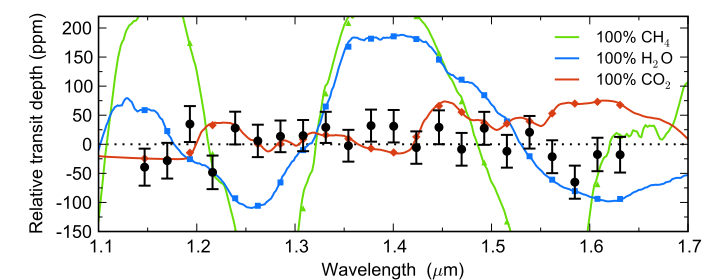
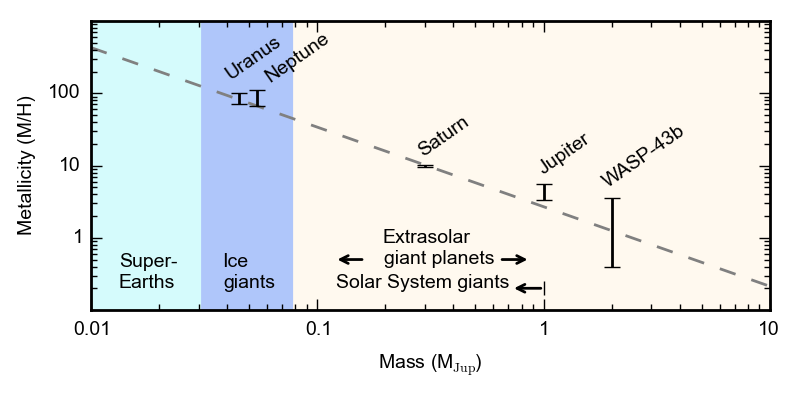
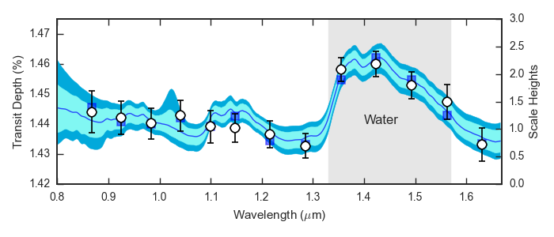

.. _research:

Research Highlights
================
Clouds in the atmosphere of GJ 1214b
----------------------------------------------------

Kreidberg, Bean, Désert, et al. 2014, *Nature*, 505, 69 [`arxiv <http://arxiv.org/abs/1401.0022v1>`_] [`ADS <http://adsabs.harvard.edu/abs/2014Natur.505...69K>`_]        

We observed a record 15 transits of the super-Earth GJ1214b with HST/WFC3 to measure the planet's transmission spectrum to unprecedented precision.  This is the first measurement sensitive to an Earth-like atmospheric composition on an exoplanet, though that is not what we found!  The featureless spectrum we obtained conclusively rules out all plausible cloud-free, high mean molecular mass compositions.  The best explanation for the data is that high altitude clouds must be present in the atmosphere.  For more info, see our `Nature paper <http://adsabs.harvard.edu/abs/2014Natur.505...69K>`_, or some of the associated media coverage at `NASA <http://www.nasa.gov/press/2013/december/nasas-hubble-sees-cloudy-super-worlds-with-chance-for-more-clouds/#.VC3jOtb9rmE>`_ , `Nature <http://www.nature.com/news/cloudy-skies-on-nearby-super-earth-1.14450>`_, `NPR <http://www.npr.org/2014/01/02/259222620/on-planet-gj1214-b-expect-exotic-cloud-cover>`_, `Time <http://science.time.com/2013/12/31/the-real-space-oddities-super-earths-and-jumbo-neptunes/>`_, the `New York Times <http://www.nytimes.com/2014/01/07/science/space/the-forecast-on-gj-1214b-extremely-cloudy.html>`_, or `space.com <http://www.space.com/24133-super-planets-alien-clouds-hubble-telescope.html>`_ 

I also made a short video with an introduction to our findings for non-scientists; check it out on `YouTube <https://www.youtube.com/watch?v=8x2DcgZiKTA>`_.

Water abundance for the hot Jupiter WASP-43b
--------------------------------------------

Kreidberg, Bean, Désert, et al. 2014, *ApJ*, 793, 27 [`arxiv <http://arxiv.org/abs/1410.2255v1>`_] [`ADS <http://adsabs.harvard.edu/abs/2014ApJ...793L..27K.>`_]

We used HST/WFC3 to obtain ultra-precise transmission and emission spectra for WASP-43b, one of the shortest-period hot Jupiters.  These data reveal that the water abundance in the planet's atmosphere is consistent with expectations for a solar composition gas to within one order of magnitude. The atmospheric metallicity implied by this measurement falls beautifully in line with the Solar System trend of decreasing metallicity with increasing planet mass (shown above).

Our team also observed three full-orbit, spectroscopic phase curves of WASP-43b to measure its thermal structure as a function of longitude and altitude -- the first ever 2D climate map of an exoplanet (`Stevenson et al. 2015, Science <http://arxiv.org/abs/1410.2241>`_).

A general summary of these results is available in the Space Telescope `press release <http://www.spacetelescope.org/news/heic1422>`_, or articles at `space.com <http://www.space.com/27394-best-alien-planet-weather-map.html>`_ and `National Geographic <http://news.nationalgeographic.com/news/2014/10/141014-space-hubble-planet-weather-science/?utm_source=Twitter&utm_medium=Social&utm_content=link_tw20141014news-hubbletele&utm_campaign=Content&sf5218387=1>`_.  I also made a `YouTube video <https://www.youtube.com/watch?v=tQZqAVhUk9E&feature=youtu.be>`_ illustrating what we learned and how we learned it.

	
Atmospheric composition of WASP-12b
-----------------------------------

Kreidberg, Line, Bean, et al., submitted to *ApJ* [`arxiv <http://arxiv.org/abs/1504.05586v1>`_]

We detected a water absorption feature in the transmission spectrum of the hot Jupiter WASP-12b (marked by the gray band above), based on six transit observations with HST/WFC3.  This is the first unambiguous identification of a molecule in the planet's atmosphere. WASP-12b has previously been suggested to have a carbon-rich composition, implying a very unusual formation pathway for the planet. However, the water feature we detect is inconsistent with carbon-rich equilibrium chemistry at greater than 3σ!  Intensive observations of the planet's thermal structure are needed to resolve the discrepancy between our measurements and past results.

